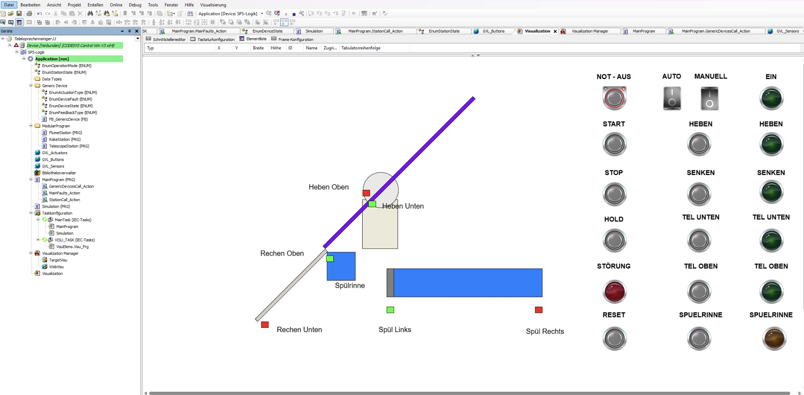
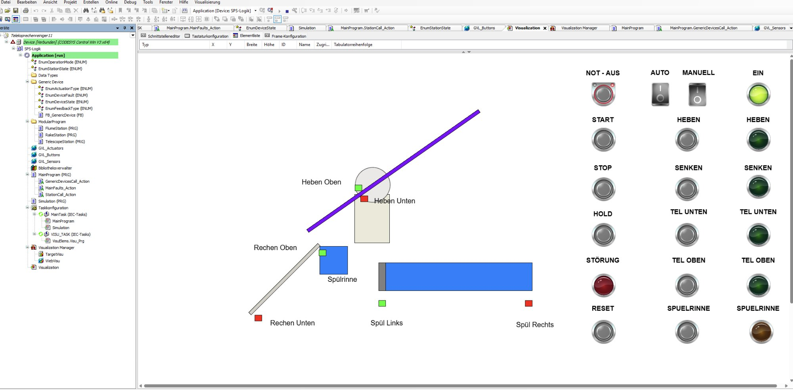
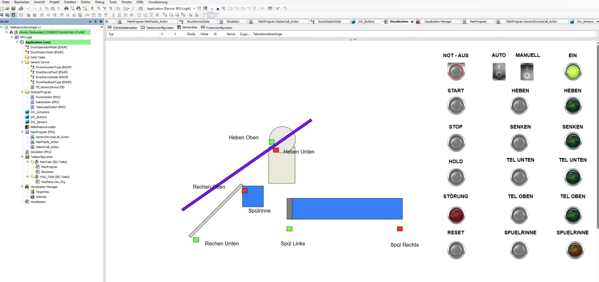

# Teleskoprechenreiniger — CODESYS SPS-Programm

[](LICENSE)
> ⚠️ **Haftungsausschluss:** Dieses Programm steuert mechanische Anlagen. Einsatz auf eigene Gefahr. Alle Sicherheitsvorschriften (EN ISO 13849, IEC 62061) müssen eingehalten werden.

Automatisierungsprojekt für einen Teleskoprechenreiniger auf Basis eines Raspberry Pi mit PIXtend V2-L Pro und CODESYS V3.5 SP21.

---

## Hardware

| Komponente | Typ | Details |
|---|---|---|
| SPS | PIXtend V2-L Pro | auf Raspberry Pi |
| Motor Heben/Senken | SEW FA57/G | 0.55kW, Bremse BE1 |
| Motor Teleskop | SEW FA67/G | 0.25kW, Bremse BE05 |
| Motor Spülschieber | Onnen Krieger | 0.25kW, ohne FU/Bremse |
| Endschalter Rechen | B-COMMAND FCN | RakeFCN_Away / RakeFCN_Home |
| Endschalter Teleskop | autosen induktiv | ExtenderSensor_Down / Up |

---

## Projektstruktur (CODESYS)

```
Application
├── EnumOperationMode, EnumStationState
├── Generic Device
│   ├── FB_GenericDevice
│   └── Enums (ActuationType, DeviceFault, DeviceState, FeedbackType)
├── ModularProgram
│   ├── FlumeStation (PRG)
│   ├── RakeStation (PRG)
│   └── TelescopeStation (PRG)
├── GVL_Actuators
├── GVL_Buttons
├── GVL_Sensors
├── MainProgram (PRG)
│   ├── GenericDevicesCall_Action
│   ├── MainFaults_Action
│   └── StationCall_Action
├── Simulation (PRG)
└── Taskkonfiguration
    ├── MainTask: 1. MainProgram, 2. Simulation
    └── VISU_TASK
```

---

## Ablaufbeschreibung (Automatikbetrieb)

```
START
  │
  ▼
State 10: Rechen schwenkt WEG (Away) → Step 100
  │
  ▼
State 20: Teleskop fährt RUNTER → Step 200
  │
  ▼
State 30: Rechen schwenkt HOME → Step 200
  │
  ▼
State 50: Teleskop fährt HOCH → Step 300
  │
  ▼
State 60: Spülschieber Zyklus → NotRunning
  │
  ▼
State 0: Ruhezustand → warten auf START
```

---

## Button-Logik (PackML-konform)

| Button | Verhalten |
|---|---|
| **START** | Zyklus starten (aus State 0) / nach HOLD: genau dort weitermachen |
| **STOP** | Laufende Bewegung zu Ende, dann Grundstellung: Flume → Teleskop hoch → Rechen Home |
| **HOLD** | Laufende Bewegung zu Ende, dann einfrieren — Resume via START |
| **NOT-AUS** | Sofortiger Motorstopp, EmergencyLatched=TRUE, kein Auto-Start bis RESET |
| **RESET** | Fehler quittieren (TimeoutError, EndlageFehler, EmergencyLatched) |
| **AUTO/MANUELL** | Umschalter: 1=Auto, 0=Manuell |

> HOLD ist nur über die Visualisierung (VISU) verfügbar — kein physischer Taster.

---

## I/O Belegung PIXtend V2-L Pro

### Digitale Eingänge (DI0–DI15)

| PIN | Variable | Beschreibung |
|---|---|---|
| DI0 | `GVL_Sensors.RakeFCN_Away` | Rechen in Away-Position |
| DI1 | `GVL_Sensors.RakeFCN_Home` | Rechen in Home-Position |
| DI2 | `GVL_Sensors.ExtenderSensor_Down` | Teleskop ausgefahren |
| DI3 | `GVL_Sensors.ExtenderSensor_Up` | Teleskop eingefahren |
| DI4 | `GVL_Sensors.FlumeSensor_Open` | Spülschieber offen |
| DI5 | `GVL_Sensors.FlumeSensor_Closed` | Spülschieber geschlossen |
| DI6 | `GVL_Buttons.EmergencyButton` | NOT-AUS ⚠️ NC-Kontakt → im I/O-Mapping invertieren |
| DI7 | `GVL_Buttons.ResetButton` | Fehler quittieren |
| DI8 | `GVL_Buttons.StartButton` | Zyklus starten |
| DI9 | `GVL_Buttons.StopButton` | Geordnet stoppen |
| DI10 | `GVL_Buttons.AutoMode` | Umschalter Auto/Manuell (1=Auto) |
| DI11 | `GVL_Buttons.ManualRakeAway` | Manuell: Rechen Away |
| DI12 | `GVL_Buttons.ManualRakeHome` | Manuell: Rechen Home |
| DI13 | `GVL_Buttons.ManualTelescopeDown` | Manuell: Teleskop runter |
| DI14 | `GVL_Buttons.ManualTelescopeUp` | Manuell: Teleskop hoch |
| DI15 | `GVL_Buttons.ManualFlume` | Manuell: Spülschieber |

### Digitale Ausgänge (DO0–DO11)

| PIN | Variable | Beschreibung |
|---|---|---|
| DO0 | `GVL_Actuators.RakeFU_Enable` | FU Rechen freigeben |
| DO1 | `GVL_Actuators.RakeFU_Away` | Rechen Away-Richtung |
| DO2 | `GVL_Actuators.RakeFU_Home` | Rechen Home-Richtung |
| DO3 | `GVL_Actuators.RakeBrake` | Bremse Rechen lösen |
| DO4 | `GVL_Actuators.TelescopeFU_Enable` | FU Teleskop freigeben |
| DO5 | `GVL_Actuators.TelescopeFU_Down` | Teleskop ausfahren |
| DO6 | `GVL_Actuators.TelescopeFU_Up` | Teleskop einfahren |
| DO7 | `GVL_Actuators.TelescopeBrake` | Bremse Teleskop lösen |
| DO8 | `GVL_Actuators.FlumeMotor_On` | Spülschieber öffnen |
| DO9 | `GVL_Actuators.FlumeMotor_Close` | Spülschieber schließen |
| DO10 | Reserve | z.B. Signallampe |
| DO11 | Reserve | z.B. Signallampe |

### Relais (R0–R3) — 230V/6A

| PIN | Variable | Beschreibung |
|---|---|---|
| R0 | Reserve | z.B. Störungslampe 230V |
| R1 | Reserve | z.B. Betriebslampe 230V |
| R2 | Reserve | — |
| R3 | Reserve | — |

### Analoge Ausgänge (AO0–AO1) — 0–10V

| PIN | Variable | Beschreibung |
|---|---|---|
| AO0 | `GVL_Actuators.RakeFU_Speed` | Drehzahl Rechen (0.0–10.0V direkt an SEW FA57) |
| AO1 | `GVL_Actuators.TelescopeFU_Speed` | Drehzahl Teleskop (0.0–10.0V direkt an SEW FA67) |

> ⚠️ Kein Tiefpassfilter nötig — AO gibt echte 0–10V DC aus, direkt kompatibel mit SEW-FU Analogeingang.

### Analoge Eingänge (AI0–AI3 / ACI0–ACI1) — Reserve

| PIN | Typ | Beschreibung |
|---|---|---|
| AI0–AI3 | 0–10V | Reserve (z.B. Füllstand, Temperatur) |
| ACI0–ACI1 | 0–20mA | Reserve |

### PWM (PWM0–PWM5) — Reserve

Alle 6 PWM-Ausgänge frei — Drehzahlsollwerte laufen über AO0/AO1.

### GPIOs (GPIO0–GPIO3) — Reserve

4x 5V GPIO frei für zukünftige Erweiterungen.

---

## Drehzahl-Sollwerte (AO, 0–10V)

| Achse | Bewegung | Wert | entspricht |
|---|---|---|---|
| Rechen | Away (Auto) | 5.0V | 50% |
| Rechen | Home (Auto) | 3.0V | 30% |
| Rechen | Manuell | 3.0V | 30% |
| Teleskop | Down (Auto) | 4.0V | 40% |
| Teleskop | Up (Auto) | 4.0V | 40% |
| Teleskop | Manuell | 2.0V | 20% |

---

## Visualisierung (VISU Screenshots)

| Schritt | Screenshot |
|---|---|
| Grundstellung — Rechen unten, Teleskop oben |  |
| Rechen Away, Teleskop oben |  |
| Rechen Away, Teleskop fährt runter |  |

---

## Offene Punkte

| # | Problem | Status |
|---|---|---|
| 1 | Stop/NotAus → Grundstellung | ✅ Implementiert |
| 2 | Hold vollständig | ✅ Implementiert |
| 3 | Visu: Lila Stab springt in Step 31 | ✅ Behoben |
| 4 | Auto/Manuell Verriegelung gegenseitig | 🔲 Offen |
| 5 | LEDs alle korrekt verdrahten | 🔲 Offen |

---

## Entwicklungsumgebung

- CODESYS V3.5 SP21
- PIXtend V2-L Pro (Raspberry Pi)
- 16x DI / 12x DO / 4x Relais / 6x PWM / 4x AI / 2x ACI / 2x AO / 4x GPIO
